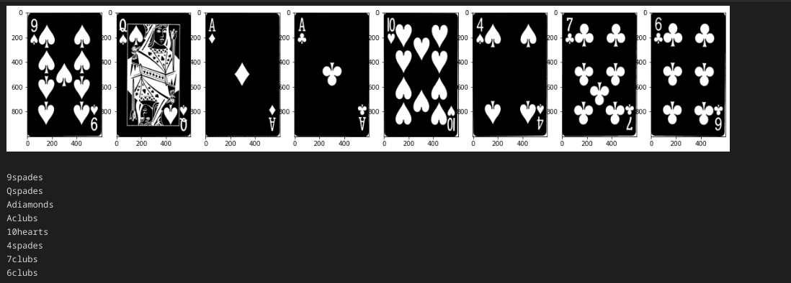

# Playing Card Detection

## Brief Description

The goal of the project is to implement a software that can detect playing cards using images. We have experimented on a wide number of images containing multiple cards and some, even with a highly skewed image, with a high success rate. 

## Setup and Installation

- The following project requires you to have opencv2, numpy, matplotlib and scikit-image libraries. Install using :
```
    sudo apt-get install python-skimage
    pip install numpy
    pip install opencv-python
    sudo apt-get install python3-matplotlib
```
- Just open jupyter file, and press run all button to run the code. 

## Sample outputs

